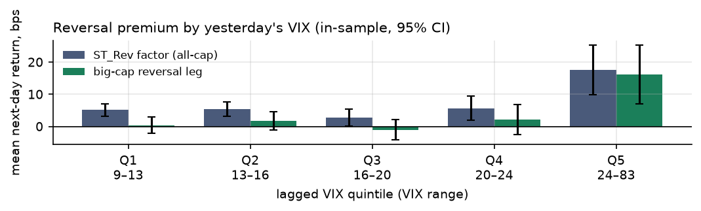
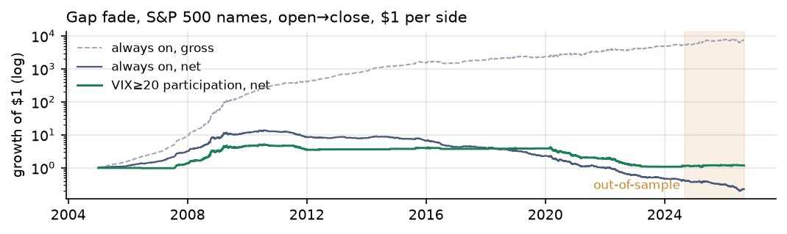
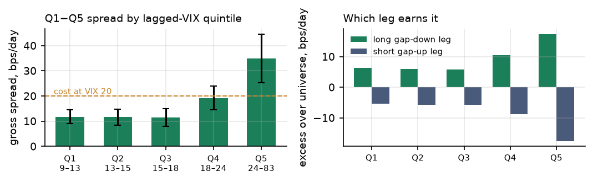
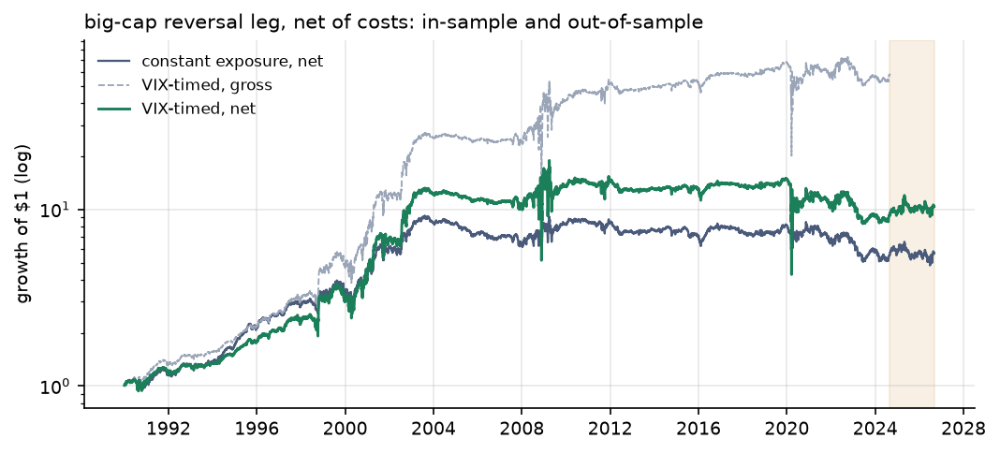
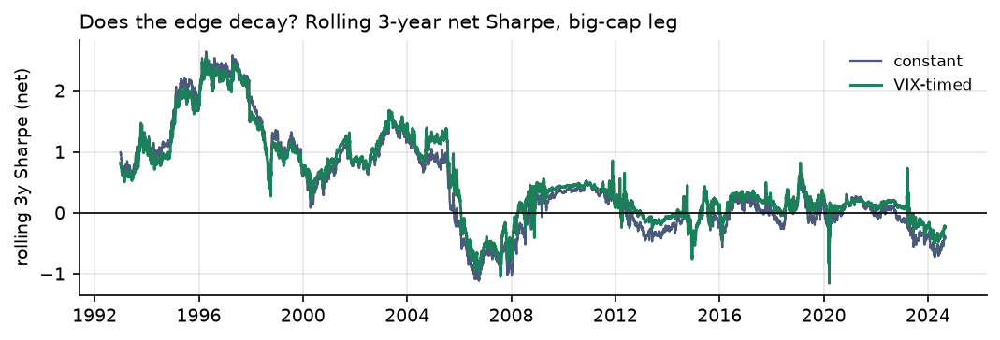
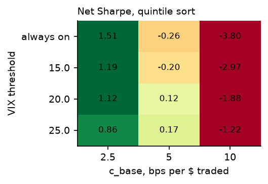

# Paid to Hold the Bag
## Liquidity provision is a high-VIX premium — at the daily horizon and at the opening auction — and that is exactly why it is hard to size

Gator Quant Hacks 2026 · Track 03 Systematic Trading · October 2026 · All numbers: <code>python run_all.py --oos</code> in the public repo · Hypotheses pre-registered in <code>HYPOTHESIS.md</code> (commit <code>0d0093d</code>, 2026-10-03 10:54 UTC) and <code>HYPOTHESIS_B.md</code> (commit <code>fbd355a</code>, 11:53 UTC), each before its first backtest

## 1. Summary

Short-term reversal is the return to supplying liquidity. Before looking at any result we hypothesised that this premium is larger when liquidity-provider capital is scarce, proxied by yesterday's VIX, and tested the one mechanism on two independent instruments. **Module A** (36 years of Kenneth French daily reversal portfolios): the expected reversal return rises with lagged VIX (Newey–West *t* = 2.4), and since 2004 the large-cap premium exists *only* in the top VIX quintile, 14 bps/day when VIX > 24, about zero otherwise; on the 44 held-out days above that level it earned 52 bps/day, on the other 455 nothing. The pre-registered rule that *levers* into high VIX fails: the book's volatility rises 3.6× across the same quintiles, so more dollars buy the same Sharpe. **Module B** takes the lesson to the opening auction. Fading overnight gaps in S&P 500 names from open to close earns 18 bps/day gross (*t* = 12, gross Sharpe 3.3), 35 bps/day in the top VIX quintile versus 12 elsewhere. At 5 bps per dollar traded it is a market maker's premium: always-on nets nothing, and the pre-registered rule — *participate* only when VIX*t*−1 ≥ 20, rather than lever — turns a −0.26 Sharpe into +0.12 in-sample and −1.83 into +0.24 on the held-out two years, when the top-VIX state paid 56 bps/day and every other state zero. The premium has decayed: 33 bps/day before 2013, 8 after. What survives for a non-market-maker is a constant-notional large-cap reversal book (net Sharpe ≈ 0.4, break-even 14 bps, $100M–$500M capacity) and, for a desk with 2.5 bps auction execution, a VIX-gated gap fade with Sharpe ≈ 1. All net of costs; all 62 variants reported.

## 2. Economic hypothesis (written before results)

**Who is on the other side.** Someone who must trade *now*: a fund meeting redemptions, a forced de-leverager, an investor reacting to overnight news with a market-on-open order. They pay, through a temporarily displaced price, for a counterparty; the price then reverts. A reversal book, daily or intraday, is a systematic way of being that counterparty.

**Why it should depend on VIX.** Liquidity providers hold inventory risk. When volatility is high their VaR limits bind, margins rise and capital is withdrawn, so the price of immediacy rises (Grossman–Miller 1988; Brunnermeier–Pedersen 2009; Nagel 2012). The edge persists because the capital that would compete it away is what is scarce when the premium is highest; at the open the same logic applies to the overnight gap (Berkman et al. 2012; Lou, Polk & Skouras 2019).

**Pre-registered predictions.** Module A — P1: slope of the daily reversal return on VIX*t*−1 positive, NW *t* > 2; P2: mean rises across lagged-VIX quintiles; P3: *wt* = min(VIX*t*−1/20, 3) beats *w* = 1 net; P4: alpha survives FF5 + momentum; P5: neighbouring parameters agree. Module B, written after A's result and before any stock data was downloaded — B1: gross gap-fade spread positive, *t* > 2; B2: slope on VIX*t*−1 positive; B3: at 5 bps, a VIX ≥ 20 participation rule beats always-on, with positive net mean; B4: both legs earn it (long leg only would suggest survivorship); B5: plateau over thresholds {15, 20, 25} and {quintile, decile}. P3 and half of B3 failed; kill criteria were written for each.

## 3. Data and universe

All public, no keys. **A:** Kenneth French Data Library (CRSP-based, point-in-time, through Aug 2026): the daily **ST_Rev** factor (long the bottom 30% on day −20 to −1 return, short the top 30%, **re-formed daily**); the daily 6 size × prior-return portfolios, from which we build the **big-cap reversal leg** BIG Lo − BIG Hi; FF5 + momentum. **B:** daily adjusted open and close for the current S&P 500 constituents (Wikipedia list snapshotted and committed; prices from Yahoo Finance via `yfinance`, cached, not committed). Each stock enters **only from its index-addition date** (326 eligible names per day in-sample, 480 recently), so none is traded before it was a large cap; removed names are absent, so the universe has survivorship bias — disclosed, and tested by B4. **Both:** FRED CBOE VIX close, aligned by a strict as-of merge so the position on day *t* sees only VIX closes dated before *t* (unit-tested).

Samples: A 1990-01-02 → 2026-08-31 (8,732 in-sample days); B 2005-01-03 → 2026-08-31 (4,949). **Held out for both: 2024-09-01 → 2026-08-31** (the 2-year cap binds; 500 days), evaluated once per module, each in its own commit after the in-sample commit.

## 4. Methodology

**Module A book and rule.** One unit is $1 long losers / $1 short winners. *wt* = min(VIX*t*−1/20, 3): 20 is the textbook long-run VIX, so *w* = 1 at VIX 20 and the rule is comparable to constant exposure; 3 is a leverage limit; nothing is fitted. **Costs:** a 20-day formation window implies 12–15% of each side turns over daily; we assume **τ = 14%** one-way, dollars traded = 2*wt*τ + 2|Δ*wt*|, and cost per dollar **ct = cbase × VIX*t*−1/20** (spreads widen with VIX; a flat-cost model flatters a VIX-timed rule), cbase = 5 bps large-cap, 10 bps all-cap; flat, ×2 and break-even costs are also reported.

**Module B book and rule.** For each stock, gap = Open*t*/Close*t*−1 − 1 minus the cross-sectional median gap; sort into quintiles at the open; $1 long the most-gapped-down quintile, $1 short the most-gapped-up, equal-weighted, **entered at the official open and closed at the official close** — never an overnight position. Rule: on iff VIX*t*−1 ≥ 20, benchmark always-on. Four dollars are traded per day per $1-per-side, so the toll is 4 × 5 bps × VIX*t*−1/20 ≈ 20 bps/day; cbase ∈ {2.5, 10} and the break-even are reported. Stock-days with |gap| > 20% (spin-off artefacts) are excluded using open information only; without the filter results are identical to 0.1 bps.

**Tests and budget.** Slopes by OLS with Newey–West (10 lags); rule comparisons by a spanning regression of rule on benchmark (HAC *t* on the intercept); A's alpha by FF5 + Mom regression. Pre-registered grids: A, normaliser {15, 20, 25} × cap {2, 3, 4} × universe × {linear, regime} = 36, plus 2 post-hoc rules (§5.4) = 38 trials entering the deflated Sharpe (Bailey & López de Prado 2014); B, threshold {off, 15, 20, 25} × {quintile, decile} × cbase {2.5, 5, 10} = 24. **62 variants, all reported.**

## 5. Results

### 5.1 Module A: the premium depends on yesterday's VIX (P1 passes, P2 passes in shape; both replicate)

| Mean next-day return, bps | slope / VIX pt | NW *t* | Q1 | Q2 | Q3 | Q4 | **Q5 (VIX > 24)** |
|---|---|---|---|---|---|---|---|
| Big-cap leg, in-sample 1990–2024 | 0.89 | 2.42 | 0.4 | 1.8 | −1.0 | 2.2 | **16.1 ± 9.1** |
| ST_Rev, in-sample | 0.78 | 2.45 | 5.2 | 5.4 | 2.8 | 5.7 | **17.6 ± 7.6** |
| Big-cap leg, **out-of-sample** | 2.94 | 2.50 | – | 6.9 | −4.3 | −13.1 | **52.4 ± 50.7** |
| ST_Rev, **out-of-sample** | 2.83 | 3.10 | – | 3.1 | −1.9 | −8.2 | **47.3 ± 44.3** |
| Big-cap leg, 2004–2024 only | 0.82 | 1.66 | −3.3 | 1.2 | −4.5 | 0.2 | **14.0** |

± is a 95% CI. 1,746 days per in-sample quintile; edges 13.2 / 16.1 / 19.6 / 24.3. Out-of-sample binned on those edges (44 days in Q5; Q1 has one day, omitted). Constant-book net Sharpe 1.02 (big-cap) / 2.25 (ST_Rev) in 1990–2003, −0.02 for both in 2004–2024.

P1 passes and replicates with the same sign and a larger slope. P2 is not monotone: flat across quintiles 1–4, then a jump. For large caps the premium is *only* in quintile 5, and the sub-period row shows why: after decimalisation and electronic market making the unconditional premium went to zero, as the hypothesis says it should when liquidity-provider capital becomes abundant; what survives is the part earned when that capital withdraws.

### 5.2 Module A's rule: more dollars, not more Sharpe (P3 fails, P4 passes)

| Net of costs | Constant, IS | **VIX-timed, IS** | Timed, flat costs | Timed, costs ×2 | Constant, **OOS** | Timed, **OOS** |
|---|---|---|---|---|---|---|
| Big-cap: ann. return / vol | 6.4% / 17.2% | 10.9% / 30.3% | 11.5% / 30.3% | 5.6% / 30.3% | 2.7% / 20.5% | 8.0% / 23.8% |
| Big-cap: **net Sharpe** (gross) | **0.37** (0.57) | **0.36** (0.53) | 0.38 | 0.18 | **0.13** (0.29) | **0.34** (0.54) |
| Big-cap: max DD / worst month / skew | −48% / −17% / +1.2 | −77% / −34% / +4.1 | | | −27% / −8% | −24% / −9% |
| ST_Rev: **net Sharpe** (gross) | **0.82** (1.30) | **0.51** (0.93) | 0.56 | 0.10 | **0.04** (0.45) | **0.21** (0.70) |
| Break-even cbase, big-cap / ST_Rev | 14.3 / 26.9 bps | 15.3 / 22.4 bps | | | | |

The timed rule lifts big-cap gross return from 9.9% to 16.2% at the same mean exposure, as predicted, but volatility goes from 17% to 30%: the book's own volatility scales with VIX, so sizing linearly in VIX scales risk quadratically. The spanning alpha of timed on constant is +0.24 bps/day (*t* = 0.3) for big caps and **−2.35 bps/day (*t* = −3.0)** for ST_Rev, whose calm-state premium the rule discards. P3 fails. P4 passes: FF5 + Mom alpha 5.8%/yr (*t* = 2.1) for the constant big-cap book, 11.1%/yr (*t* = 4.8) for ST_Rev; market beta 0.2, R² ≈ 0.1. The grid is a plateau (0.34–0.39; P5 passes) and luck alone would give a best-of-38 Sharpe of 0.24. Out of sample the timed rule beat constant, but the spanning alpha has *t* = 1.1 after failing on 35 years; we do not count it as support for P3: the premium arrived on the 44 high-VIX days and a rule long VIX happened to be large on them (equity curves in the appendix).

### 5.3 Module B: the opening auction pays the same premium, in the same states (B1, B2, B4, B5 pass; B3 half)

| Q1 − Q5 gap-fade spread, open→close | gross bps/day (NW *t*) | slope per VIX pt (*t*) | VIX Q1 … Q5, bps | net Sharpe @5 bps: always-on / **gated** | spanning *t* | break-even cbase | @2.5 bps: always / gated | days on |
|---|---|---|---|---|---|---|---|---|
| In-sample 2005–2024 | **17.8** (12.1) | 1.39 (3.8) | 12 · 12 · 11 · 19 · **35 ± 10** | −0.26 / **+0.12** | 2.6 | 4.6 / 5.3 bps | 1.51 / 1.12 | 33% |
| 2005–2012 | 32.6 (12.3) | 1.69 (3.7) | 24 → **59** | 1.84 / 1.19 | | 7.6 / 7.6 | | |
| 2013–2024 | 7.6 (5.6) | 0.26 (0.8) | 5 → 11 | −2.06 / −1.00 | | 2.2 / 2.3 | | |
| **Out-of-sample** 2024-09 → 2026-08 | 6.7 (1.4) | **3.98 (3.3)** | – · 0 · 0 · 4 · **56 ± 43** | −1.83 / **+0.24** | 2.0 | 1.8 / 5.9 | −0.40 / 0.92 | 24% |

Equal-weighted quintiles on the gap relative to the median gap; $1 per side; cost 4 × cbase × VIXt−1/20 per day. OOS VIX bins use in-sample edges (Q1 empty). Legs, excess over the universe's open→close return: long gap-down +9.2 bps (t = 11.8), short gap-up −8.6 bps (t = −11.2) in-sample; +4.4 / −2.3 out of sample. Decile sort: net Sharpe at 5 bps 0.97 always-on / 0.89 gated in-sample, −1.23 / 0.53 out of sample.

Gross, this is a 3-Sharpe machine, and it is the mechanism of §5.1 at a shorter horizon: 35 bps/day in the top VIX quintile against 12 in the rest, both legs symmetric (B4 passes; survivorship is not the story), slope *t* = 3.8. Net, at 5 bps per dollar traded, the ≈20 bps/day toll eats the unconditional premium (always-on nets −0.26), and the participation rule does what it was built to do — pays the toll only when the premium exceeds it, lifting Sharpe to +0.12 with spanning *t* = 2.6 — but its net mean is not significantly positive (*t* = 0.5): **at 5 bps this is a market maker's premium.** Two facts matter more than the headline. The premium is decaying: 33 bps/day and a 7.6 bps break-even before 2013, 8 bps and 2.2 bps since, as electronic market making in the auctions caught up; a 2.5 bps executor earned Sharpe 1.5 over the full sample and roughly zero since 2013. And the held-out two years are the sharpest state-dependence we have seen anywhere: unconditional gross fell to 6.7 bps, the VIX slope rose to 4 bps per point (*t* = 3.3), the 50 days with VIX*t*−1 > 24 (the spring 2025 and spring 2026 spikes) paid **56 bps/day** and every other state paid zero. Always-on lost 30% net; the gated book made 2.5% with a 9% drawdown, Sharpe 0.9 at 2.5 bps.

### 5.4 Post-hoc, disclosed: sizing Module A by risk instead (2 extra trials)

The natural fix for §5.2 is to size by expected return per unit of variance: *wt* ∝ max(E[*rt* | VIX*t*−1], 0) / σ̂*t*2, with E[*r* | VIX] from an expanding regression on days before *t* (5-year burn-in) and σ̂ the trailing 63-day vol, against a vol-targeted book (Moreira–Muir 2017) and constant exposure on the same days (big-cap leg, 1995–2024, net Sharpe / max DD / worst month): constant **0.31** / −48% / −17%; vol-targeted **0.01** / −70% / −14%; mean-variance **0.19** / −74% / **−53%**. Vol targeting, the default risk tool, **destroys the strategy**: it de-risks exactly when the premium is paid. The mean-variance rule's −53% month is March 2020: the forecast said "premium high", the rule went to the 3× cap, and reversal kept losing as the crash continued (out of sample: 0.24× average exposure, Sharpe 0.45, two years). This is why Module B pre-registered participation rather than leverage: the premium is large in high-VIX states *because* the outcomes there are wild, and with ~1,750 such days in a few dozen episodes no rule can estimate the conditional moments well enough to lever safely.

## 6. Risk management

**What the books are.** A: long/short equity, residual market beta 0.2, skew +1.2 and excess kurtosis 23 at constant notional; the timed version has skew +4 and kurtosis 127, a P&L made of a few enormous days. B: dollar-neutral, equal-weighted, flat at every close, so no overnight, gap or financing risk; its risk is one session's cross-sectional dispersion (worst day −6.6%, 9 Nov 2020, the vaccine rotation: those gaps were information). **Limits:** gross ≤ 2× capital (3× was A's pre-registered cap); per-name ≤ 2% of gross with a mega-cap concentration cap; sector-neutral legs; a futures hedge taking beta to zero. **De-risking rule, set in advance: none that depends on realised vol**, since §5.4 shows that is the one thing that kills the premium. *Participation* in the state is the risk tool instead: B is off two-thirds of the time and, when on, sized so the pre-registered worst month at 1× (A −17%; B −16%) and drawdown (A −48%; B gated −79%, a slow bleed from 2010 to 2023 through 2011 and 2020–22, when it was on and the premium had thinned) are survivable — a 5%-per-month risk budget implies 0.3× capital for either. **Tail and regime:** the book loses when the hurried trader knew something (2009, 2020). Those are the risks being insured. In quintiles 1–4 the modern premium is zero, so a non-market-maker is paid nothing for the risk it runs there.

## 7. Liquidity and capacity

**A** turns over 70× its capital a year. One-way cost = half-spread + square-root impact, c(K) = 1.5 bps + σname√(participation), with ≈ 500 large-cap names, value-weighted ADV ≈ $200M, single-name daily vol 2% at VIX 20 (`src/gqh/capacity.py`): $10M → 2.6 bps and Sharpe 0.47; $100M → 4.8 bps, 0.38; $500M → 9.0 bps, 0.21; $1.5B → 14.3 bps, 0.00. Our 5 bps assumption is about $100M; the edge is half gone near $500M. **B** trades only in the two auctions, at one price with no spread to cross, and its constraint is the open, which clears only ~1–2% of a name's daily volume (the close clears ~10%). With ~80 names per leg, $25M of book is ~$150k per name, about 5% of a $3M opening auction in a $200M-ADV name; $100M would be ~20%, where impact sets the cost. B is a desk-scale trade — tens of millions, not hundreds; 5 bps is our headline and 2.5 bps an execution desk's number. A market maker who *earns* the half-spread faces a negative first term in both books and the gross Sharpes (0.57 and 3.3) are on offer, which is why both premia belong to market makers.

## 8. Limitations and next steps

(i) The French portfolios are a test instrument, not a product; B's universe is survivorship-biased (removed names are missing), though the symmetric legs say the result is not drift. (ii) A's turnover and both cost models are assumed, not observed, and stressed; a desk's fill data would replace them. (iii) B assumes execution at the official open from orders placed on pre-market prints; that slippage sits in the cost assumption, and part of the premium may live inside the first minutes. (iv) VIX is one proxy for intermediary capital, and the top-quintile effect rests on ~1,750 in-sample and 44–50 held-out days: the sign replicated with 2–4× the slope, but the 52–56 bps carry ±45 bps intervals. (v) "VIX > 24" was deliberately *not* turned into a rule — that would be the snooping the brief warns about — and Yahoo data can be revised, so the download is cached and the constituent file frozen. **Next:** non-volatility proxies for intermediary capital (dealer leverage, funding spreads) so sizing can be separated from vol; signed auction imbalance; a Q5-only book on a sealed window before believing 50 bps.

## References (outside the page limit)

Almgren, R., Thum, C., Hauptmann, E. & Li, H. (2005). Direct Estimation of Equity Market Impact. *Risk* 18. · Bailey, D. H. & López de Prado, M. (2014). The Deflated Sharpe Ratio. *Journal of Portfolio Management* 40(5). · Berkman, H., Koch, P. D., Tuttle, L. & Zhang, Y. J. (2012). Paying Attention: Overnight Returns and the Hidden Cost of Buying at the Open. *Journal of Financial and Quantitative Analysis* 47(4). · Brunnermeier, M. K. & Pedersen, L. H. (2009). Market Liquidity and Funding Liquidity. *Review of Financial Studies* 22(6). · Chordia, T., Subrahmanyam, A. & Tong, Q. (2014). Have Capital Market Anomalies Attenuated in the Recent Era of High Liquidity and Trading Activity? *Journal of Accounting and Economics* 58. · Fama, E. F. & French, K. R. (2015). A Five-Factor Asset Pricing Model. *Journal of Financial Economics* 116. · Grossman, S. J. & Miller, M. H. (1988). Liquidity and Market Structure. *Journal of Finance* 43(3). · Heston, S. L., Korajczyk, R. A. & Sadka, R. (2010). Intraday Patterns in the Cross-section of Stock Returns. *Journal of Finance* 65(4). · Jegadeesh, N. (1990). Evidence of Predictable Behavior of Security Returns. *Journal of Finance* 45(3). · Lou, D., Polk, C. & Skouras, S. (2019). A Tug of War: Overnight Versus Intraday Expected Returns. *Journal of Financial Economics* 134(1). · Moreira, A. & Muir, T. (2017). Volatility-Managed Portfolios. *Journal of Finance* 72(4). · Nagel, S. (2012). Evaporating Liquidity. *Review of Financial Studies* 25(7). · Data: Kenneth R. French Data Library (CRSP-based); FRED, Federal Reserve Bank of St. Louis, series VIXCLS; Yahoo Finance daily prices via `yfinance`; Wikipedia, List of S&P 500 companies (snapshot 2026-10-03).

## Appendix (optional, outside the page limit)

**A1. Module A, all 36 pre-registered variants, net Sharpe in-sample.** Big-cap, linear rule, rows cap {2,3,4} × cols normaliser {15,20,25}: 0.39 0.37 0.36 / 0.37 0.36 0.35 / 0.36 0.35 0.34; regime rule 0.39. ST_Rev: 0.62 0.57 0.54 / 0.55 0.51 0.49 / 0.51 0.48 0.48; regime rule 0.47. `results/tables/sensitivity_grid.csv`.

**A2. Module B, all 24 pre-registered variants, net Sharpe in-sample** (rows cbase 2.5 / 5 / 10 bps; cols always-on, VIX ≥ 15, 20, 25). Quintile: 1.51 1.19 1.12 0.87 / −0.26 −0.20 0.12 0.17 / −3.80 −2.97 −1.88 −1.22. Decile: 2.32 1.88 1.65 1.27 / 0.97 0.81 0.89 0.75 / −1.77 −1.35 −0.67 −0.33. Out of sample, quintile: −0.40 −0.29 0.92 1.04 / −1.83 −1.64 0.24 0.68 / −4.73 −4.33 −1.13 −0.07. `results/tables/gapfade_sensitivity_grid*.csv`, `results/REPORT_B.md`.

**A3. Big-cap leg, net return by year, timed / constant (%).** 1990–99: 6/3, 13/14, 9/13, 3/4, 15/24, 15/25, 18/21, 11/12, 34/17, −5/−3. 2000–09: 34/23, 69/50, 56/28, 16/9, 0/0, −8/−13, −3/−5, −5/−9, 61/31, −19/0. 2010–24: 4/2, 1/−2, −11/−11, 1/2, 2/0, −2/−7, 7/12, −3/−5, −2/−4, 11/13, −22/−5, −7/−12, 0/−3, −15/−12, 2/−4. **Gap fade, net by year, gated / always-on (%):** 2005–09: 0/17, −2/35, 41/106, 142/159, 39/41; 2010–14: 0/7, −23/−32, 1/−1, 0/−6, 3/2; 2015–19: 6/−18, −5/−35, 0/−5, 4/−20, −1/−30; 2020–24: −37/−42, −22/−24, −35/−40, −12/−23, 5/−12.

**A4. Honesty log.** Module A: hypothesis commit 10:54 UTC; in-sample commit 11:11 with OOS locked; OOS evaluated once and committed 11:12. Module B: hypothesis and frozen constituent list committed 11:53:57, before any price download; in-sample committed 12:01:40; OOS evaluated once, committed 12:02:08. The sub-period split of B (2005–2012 / 2013–2024) was decided after seeing the by-year table and is labelled descriptive. One bug fixed after A's first in-sample run: factor betas were in mixed units; alphas and t-stats unaffected. 62 variants in total. The practitioner material we were given (an intraday gap-fade strategy matrix and ML-ops code) contained no price or trade data and was used only to motivate Module B's design.

