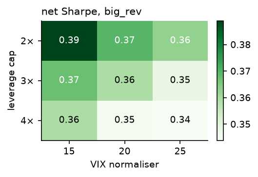
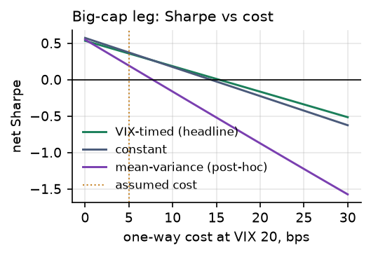
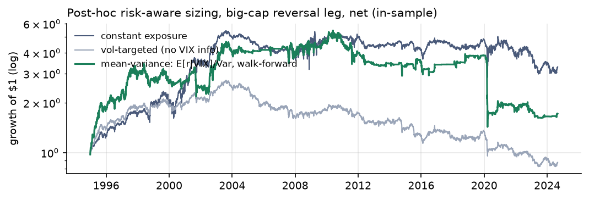
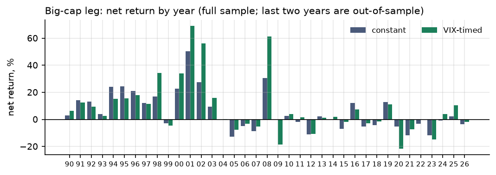

# Paid to Hold the Bag
## The short-term reversal premium is a high-VIX premium, and that is exactly why it is hard to size

Gator Quant Hacks 2026 · Track 03 Systematic Trading · October 2026 · All numbers: <code>python run_all.py --oos</code> in the public repo · Hypothesis pre-registered in <code>HYPOTHESIS.md</code>, commit <code>0d0093d</code>, 2026-10-03 10:54 UTC, before any backtest

## 1. Summary

Short-term reversal, buying last month's losers and selling last month's winners, is the return to supplying liquidity. Before looking at any result we hypothesised that this premium is larger when liquidity-provider capital is scarce, proxied by yesterday's VIX, and pre-registered a rule that scales a daily reversal book by VIX. **The economic hypothesis holds and replicates out of sample; the sizing rule does not beat constant exposure.** Over 36 years the expected reversal return rises with lagged VIX (Newey–West *t* = 2.4), and since 2004 the large-cap premium exists *only* in the top VIX quintile: 14 bps/day when VIX > 24, about zero otherwise. On the 44 held-out days (Sep 2024 – Aug 2026) above that level it earned 52 bps/day; on the other 455, nothing. But the book's volatility rises 3.6× across the same quintiles and its worst losses (March 2020) fall *inside* the high-VIX state. It is an insurance premium. Levering into it doubles risk for the same Sharpe; vol-targeting out of it leaves nothing; a mean-variance rule built afterwards had a −53% month. What survives is a constant-notional large-cap book: net Sharpe ≈ 0.4 at 5 bps, break-even 14 bps, $100M–$500M of capacity for a market taker. All results are net of costs; all 38 variants tried are reported.

## 2. Economic hypothesis (written before results)

**Who is on the other side.** Someone who must trade *now*: a fund meeting redemptions, a forced de-leverager, a hurried rebalancer. They pay, through a temporarily displaced price, for a counterparty; the price then reverts. The reversal portfolio is a systematic way of being that counterparty.

**Why it should depend on VIX.** Liquidity providers hold inventory risk. When volatility is high their VaR limits bind, margins rise and capital is withdrawn, so the price of immediacy rises (Grossman–Miller 1988; Brunnermeier–Pedersen 2009; Nagel 2012 shows lagged VIX predicts reversal returns). The edge persists because the capital that would compete it away is what is scarce when the premium is highest.

**Pre-registered predictions.** P1: the slope of the daily reversal return on VIX*t*−1 is positive, NW *t* > 2. P2: mean return rises across lagged-VIX quintiles. P3: *wt* = min(VIX*t*−1/20, 3) earns a higher net Sharpe than *w* = 1. P4: alpha survives FF5 + momentum. P5: neighbouring parameters agree. Kill criteria were written for each; P3 is the one that failed.

## 3. Data and universe

All public, no keys. Kenneth French Data Library (CRSP-based, through Aug 2026): the daily **ST_Rev** factor (long the bottom 30% on day −20 to −1 return, short the top 30%, small and big averaged, value-weighted, **re-formed daily**); the daily 6 size × prior-return portfolios, from which we build the **big-cap reversal leg** BIG Lo − BIG Hi (stocks above the NYSE median cap, what a fund could trade at size); FF5 + momentum factors. FRED: CBOE VIX close. ST_Rev is the most powerful test of the hypothesis; the big-cap leg is the implementation and the subject of the cost and capacity analysis. Both are reported throughout.

Sample 1990-01-02 (first VIX print) to 2026-08-31. **Held out: 2024-09-01 → 2026-08-31** (20% of 36.7 years is 7.3 years, so the track's 2-year cap binds; 500 days held out, 8,732 in-sample). The French universes are point-in-time CRSP (no survivorship bias), prices are adjusted for corporate actions, and missing-value sentinels are dropped. VIX is aligned by a strict as-of merge: the position on day *t* sees only VIX closes dated before *t* (unit-tested).

## 4. Methodology

**Book and rule.** One unit of exposure is $1 long losers / $1 short winners (gross 2). *wt* = min(VIX*t*−1/20, 3): 20 is the textbook long-run VIX, so *w* = 1 at VIX 20 and the rule is directly comparable to constant exposure; 3 is a leverage limit. Nothing is fitted, so no walk-forward tuning is needed.

**Costs, the whole question for a daily book.** With a 20-day formation window, consecutive sorting variables have correlation 19/20, implying 12–15% of each side turns over daily; we assume one-way turnover **τ = 14% of gross per day** (unobservable from public data, so stressed). Dollars traded = 2*wt*τ + 2|*wt* − *wt*−1|. Cost per dollar **ct = cbase × VIX*t*−1/20**, since spreads widen with VIX (a flat-cost model flatters a VIX-timed rule); cbase = 5 bps large-cap, 10 bps all-cap. We also report flat costs, costs ×2 and the break-even cbase.

**Tests and budget.** P1 by OLS with Newey–West (10 lags) errors; P2 by quintile means; P3 by a spanning regression of timed on constant (HAC *t* on the intercept); P4 by FF5 + Mom regression. Pre-registered grid: normaliser {15, 20, 25} × cap {2, 3, 4} × universe × {linear, regime} = 36 variants, plus 2 post-hoc rules (§5.4) = **38 trials**, all entering the deflated Sharpe (Bailey & López de Prado 2014). **Protocol:** the in-sample study was committed with the hold-out locked; `--oos` was then run once and committed separately.

## 5. Results

### 5.1 The premium depends on yesterday's VIX (P1 passes, P2 passes in shape; both replicate)

| Mean next-day return, bps | slope / VIX pt | NW *t* | Q1 | Q2 | Q3 | Q4 | **Q5 (VIX > 24)** |
|---|---|---|---|---|---|---|---|
| Big-cap leg, in-sample | 0.89 | 2.42 | 0.4 | 1.8 | −1.0 | 2.2 | **16.1 ± 9.1** |
| ST_Rev, in-sample | 0.78 | 2.45 | 5.2 | 5.4 | 2.8 | 5.7 | **17.6 ± 7.6** |
| Big-cap leg, **out-of-sample** | 2.94 | 2.50 | – | 6.9 | −4.3 | −13.1 | **52.4 ± 50.7** |
| ST_Rev, **out-of-sample** | 2.83 | 3.10 | – | 3.1 | −1.9 | −8.2 | **47.3 ± 44.3** |
| Big-cap leg, **2004–2024** only | 0.82 | 1.66 | −3.3 | 1.2 | −4.5 | 0.2 | **14.0** |
| ST_Rev, **2004–2024** only | 0.82 | 1.95 | −1.4 | 1.2 | −2.9 | 3.0 | **15.1** |

± is a 95% CI. In-sample 1990–2024, 1,746 days per quintile; quintile edges 13.2 / 16.1 / 19.6 / 24.3. Out-of-sample 2024-09 → 2026-08 binned on those edges (44 days in Q5; Q1 has one day, omitted). Constant-book net Sharpe: 1.02 (big-cap) and 2.25 (ST_Rev) in 1990–2003, −0.02 for both in 2004–2024.

P1 passes and replicates with the same sign and a larger slope. P2 is not monotone: flat across quintiles 1–4, then a jump. For large caps the premium is *only* in quintile 5, and the sub-period rows show why: after decimalisation and electronic market making the unconditional premium went to zero (Sharpe 1.02 → −0.02), as the hypothesis says it should when liquidity-provider capital becomes abundant. What survives is the part earned when that capital withdraws.

### 5.2 The pre-registered rule: more dollars, not more Sharpe (P3 fails, P4 passes)

| In-sample, net | Constant | **VIX-timed** | Timed, flat costs | Timed, costs ×2 | Constant, costs ×2 |
|---|---|---|---|---|---|
| Big-cap: ann. return / vol | 6.4% / 17.2% | 10.9% / 30.3% | 11.5% / 30.3% | 5.6% / 30.3% | 3.0% / 17.2% |
| Big-cap: **net Sharpe** (gross) | **0.37** (0.57) | **0.36** (0.53) | 0.38 | 0.18 | 0.17 |
| Big-cap: max DD / worst month / skew | −48% / −17% / +1.2 | −77% / −34% / +4.1 | | | |
| ST_Rev: **net Sharpe** (gross) | **0.82** (1.30) | **0.51** (0.93) | 0.56 | 0.10 | 0.33 |
| ST_Rev: max DD / worst month | −46% / −16% | −78% / −31% | | | |
| Turnover, $ traded / $ capital / yr | 70.6 | 92.8 | 92.8 | 92.8 | 70.6 |
| Break-even cbase, big-cap / ST_Rev | 14.3 / 26.9 bps | 15.3 / 22.4 bps | | | |

The timed rule lifts big-cap gross return from 9.9% to 16.2% at the same mean exposure (0.97), as predicted, but volatility goes from 17% to 30%: the book's own volatility scales with VIX, so sizing linearly in VIX scales risk quadratically. The spanning alpha of timed on constant is +0.24 bps/day (*t* = 0.3) for big caps and **−2.35 bps/day (*t* = −3.0)** for ST_Rev, whose calm-state premium the rule throws away. P3 fails. P4 passes: FF5 + Mom alpha is 5.8%/yr (*t* = 2.1) for the constant big-cap book and 11.1%/yr (*t* = 4.8) for ST_Rev; market beta 0.2, momentum beta ≈ 0, R² ≈ 0.1. The grid is a plateau (0.34–0.39; P5 passes) and luck alone would give a best-of-38 Sharpe of 0.24, so 0.36 is not a search artefact; it is just no better than doing nothing clever.

Left: net Sharpe of the big-cap rule across the pre-registered grid. Right: net Sharpe against one-way cost at VIX 20; constant breaks even at 14 bps, timed at 15, the post-hoc mean-variance rule at 8.

### 5.3 Out of sample, one run

| Net, 2024-09-03 → 2026-08-31 | Big-cap constant | Big-cap timed | ST_Rev constant | ST_Rev timed |
|---|---|---|---|---|
| Ann. return / vol | 2.7% / 20.5% | 8.0% / 23.8% | 0.6% / 16.1% | 4.1% / 19.7% |
| **Sharpe** (gross) | **0.13** (0.29) | **0.34** (0.54) | **0.04** (0.45) | **0.21** (0.70) |
| Max drawdown / worst month | −27% / −8% | −24% / −9% | −19% / −6% | −18% / −5% |

The timed rule beat constant exposure on the held-out two years, but the spanning alpha is 2.1 bps/day with *t* = 1.1, after failing on 35 years in-sample; we do not count it as support for P3. The honest reading is §5.1: the unconditional book stayed near zero, the premium arrived on the 44 high-VIX days (the March–May 2025 and March–April 2026 spikes), and a rule long VIX happened to be large on those days.

### 5.4 Post-hoc, disclosed: sizing by risk instead (2 extra trials)

The natural fix for §5.2 is to size by expected return per unit of variance: *wt* ∝ max(E[*rt* | VIX*t*−1], 0) / σ̂*t*2, with E[*r* | VIX] from an expanding regression on days before *t* (5-year burn-in, so comparisons start in 1995) and σ̂ the trailing 63-day realised vol, against a plain vol-targeted book (Moreira–Muir 2017) and constant exposure on the same days.

| Big-cap leg, net | Constant | Vol-targeted (no VIX) | Mean-variance (walk-forward) |
|---|---|---|---|
| In-sample 1995–2024: Sharpe / max DD / worst month / skew | **0.31** / −48% / −17% / +1.2 | **0.01** / −70% / −14% / 0.0 | **0.19** / −74% / **−53%** / −1.5 |
| ST_Rev in-sample: Sharpe | 0.43 | 0.14 | 0.28 |
| Out-of-sample: Sharpe / max DD / mean exposure | 0.13 / −27% / 1.00 | 0.05 / −12% / 0.56 | 0.45 / −5% / 0.24 |

Vol targeting, the default risk tool, **destroys the strategy**: it de-risks exactly when the premium is paid. The mean-variance rule beats vol targeting but not constant, and its −53% month is March 2020: the forecast said "premium high", the rule went to the 3× cap, and reversal kept losing as the crash continued. Out of sample it averaged 0.24× exposure and did well, on two years. This explains the conclusion rather than changing it: the premium is large in high-VIX states *because* the outcomes there are wild, and with ~1,750 such days in a few dozen episodes no rule can estimate the conditional moments well enough to lever safely.

## 6. Risk management

**What the book is.** Long/short equity with residual market beta 0.2 (fallen stocks have higher beta), skew +1.2 and excess kurtosis 23 at constant notional; the timed version has skew +4 and kurtosis 127, a P&L made of a few enormous days. **Limits:** gross ≤ 2× capital (3× was the pre-registered cap; in practice ≤ 1×); per-name ≤ 2% of gross with an extra cap on mega-cap concentration (the French legs are value-weighted); sector-neutral legs; a futures hedge taking beta to zero. **De-risking rule, set in advance: none that depends on realised vol**, since §5.4 shows that is the one thing that kills the premium. Size instead so the pre-registered worst month at 1× (−17%) and drawdown (−48%) are survivable: a 5%-per-month risk budget implies 0.3× capital. **Tail and regime:** the book loses when the hurried trader knew something (2020, 2009). Those are the risks being insured; a provider who exits in them has not provided liquidity. The risk is also asymmetric by state: in quintiles 1–4 the modern large-cap premium is zero, so a non-market-maker is paid nothing for the risk it runs there.

## 7. Liquidity and capacity

Seventy times its capital changes hands each year, so this is a trade for low-cost participants. One-way cost = half-spread + square-root impact: c(K) = 1.5 bps + σname √(participation), with ≈ 500 large-cap names, value-weighted ADV ≈ $200M per name, single-name daily vol 2% at VIX 20, participation = daily dollars traded per name ÷ ADV. Assumptions are explicit in `src/gqh/capacity.py`.

| Capital | $10M | $100M | $250M | $500M | $1B | $1.5B | $2.5B |
|---|---|---|---|---|---|---|---|
| Participation, % of ADV | 0.003 | 0.03 | 0.07 | 0.14 | 0.28 | 0.42 | 0.70 |
| One-way cost, bps | 2.6 | 4.8 | 6.8 | 9.0 | 12.1 | 14.3 | 18.2 |
| Constant big-cap book, net Sharpe (in-sample) | 0.47 | 0.38 | 0.30 | 0.21 | 0.09 | **0.00** | −0.16 |

Our 5 bps assumption is about $100M; the edge is half gone near $500M and gone at $1.5B. A market maker who *earns* the half-spread faces a negative first term and the gross Sharpe (0.57 big-cap, 1.30 all-cap) is on offer, which is why the premium belongs to market makers and vanished from calm markets once they became efficient. VIX-scaled costs matter: the timed rule pays 5.3%/yr versus 4.6% under flat costs.

## 8. Limitations and next steps

(i) The French portfolios are the test instrument, not a product: a live book needs its own point-in-time universe and sector neutralisation. (ii) Turnover (14%/day) and costs are modelled, not observed; both are stressed, and a desk's fill data would replace them. (iii) VIX is one proxy for intermediary capital, and the top-quintile effect rests on ~1,750 in-sample days and 44 held-out days: the sign replicated, the 52 bps has a ±50 bps interval. (iv) The quintile tables are descriptive; "VIX > 24" was deliberately *not* turned into a rule, since that would be the snooping the brief warns about. (v) The mean-variance rule is post-hoc; its OOS Sharpe rests on two years. **Next:** repeat the test with intermediary-capital proxies that are not volatility (dealer leverage, funding spreads) so sizing can be separated from vol; condition on *signed* order imbalance; and run the Q5-only book on a sealed window before believing the 52 bps.

## References (outside the page limit)

Almgren, R., Thum, C., Hauptmann, E. & Li, H. (2005). Direct Estimation of Equity Market Impact. *Risk* 18. · Bailey, D. H. & López de Prado, M. (2014). The Deflated Sharpe Ratio. *Journal of Portfolio Management* 40(5). · Brunnermeier, M. K. & Pedersen, L. H. (2009). Market Liquidity and Funding Liquidity. *Review of Financial Studies* 22(6). · Chordia, T., Subrahmanyam, A. & Tong, Q. (2014). Have Capital Market Anomalies Attenuated in the Recent Era of High Liquidity and Trading Activity? *Journal of Accounting and Economics* 58. · Fama, E. F. & French, K. R. (2015). A Five-Factor Asset Pricing Model. *Journal of Financial Economics* 116. · Grossman, S. J. & Miller, M. H. (1988). Liquidity and Market Structure. *Journal of Finance* 43(3). · Jegadeesh, N. (1990). Evidence of Predictable Behavior of Security Returns. *Journal of Finance* 45(3). · Moreira, A. & Muir, T. (2017). Volatility-Managed Portfolios. *Journal of Finance* 72(4). · Nagel, S. (2012). Evaporating Liquidity. *Review of Financial Studies* 25(7). · Data: Kenneth R. French Data Library (CRSP-based); FRED, Federal Reserve Bank of St. Louis, series VIXCLS.

## Appendix (optional, outside the page limit)

**A1. All 36 pre-registered variants, net Sharpe in-sample.** Big-cap, linear rule, rows cap {2,3,4} × cols normaliser {15,20,25}: 0.39 0.37 0.36 / 0.37 0.36 0.35 / 0.36 0.35 0.34; regime rule 0.39. ST_Rev: 0.62 0.57 0.54 / 0.55 0.51 0.49 / 0.51 0.48 0.48; regime rule 0.47. `results/tables/sensitivity_grid.csv`.

**A2. Big-cap leg, net return by year, timed / constant (%).** 1990–99: 6/3, 13/14, 9/13, 3/4, 15/24, 15/25, 18/21, 11/12, 34/17, −5/−3. 2000–09: 34/23, 69/50, 56/28, 16/9, 0/0, −8/−13, −3/−5, −5/−9, 61/31, −19/0. 2010–24: 4/2, 1/−2, −11/−11, 1/2, 2/0, −2/−7, 7/12, −3/−5, −2/−4, 11/13, −22/−5, −7/−12, 0/−3, −15/−12, 2/−4. Full tables in `results/REPORT.md`.

**A3. Honesty log.** Hypothesis commit 10:54 UTC; in-sample commit 11:11 UTC with OOS locked; OOS evaluated once at 11:11:53 UTC and committed at 11:12 UTC (the pipeline was re-run later only to resize figures; numbers identical). One bug fixed after the first in-sample run: factor betas were in mixed units; alphas and t-stats unaffected. 38 trials in total.

